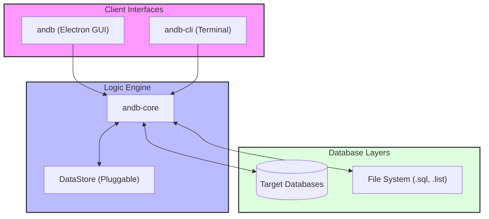

# Andb Landing Page

This repository contains the source code for the official landing page of **Andb** - The Simplest Database Migration Tool.

It is designed to be a lightweight, high-performance static site hosting:

- 🚀 Product Features Showcase
- 🖼️ Application Screenshots (Dynamic 3D Carousel)
- 📥 Official Download Links (v2.1.1 Live)
- 🌓 Dark/Light Mode previews

## 🏗️ Architecture Overview

The Andb ecosystem consists of three main components working together to provide a seamless database migration experience:

### 📦 Component Details

- **Andb (UI)**: The desktop application (built with Electron & Vue 3) targeted at developers who prefer a visual workflow. It provides interactive schema comparisons, migration previews, and environment management.
- **andb-core**: The universal engine that handles the heavy lifting. It includes the database connectors, comparison logic, and script generators. Its pluggable architecture allows it to run in both UI and CLI environments.
- **andb-cli**: A thin command-line wrapper around `andb-core`. It's designed for speed and automation, perfectly suited for CI/CD pipelines or headless server environments.

## Key Links

- **Official Repository**: [The-Andb/andb](https://github.com/The-Andb/andb)
- **Andb Core**: [The-Andb/andb-core](https://github.com/The-Andb/andb-core)
- **Andb CLI**: [The-Andb/andb-cli](https://github.com/The-Andb/andb-cli)

## 🛠️ Development

The landing page (`index.html`) is built with:

- **HTML5**
- **Tailwind CSS** (via CDN for zero-build setup)
- **Lucide Icons**
- **Vanilla JavaScript** (for the 3D Carousel & Theme Toggle logic)

### Editing

Simply open `index.html` in your browser to preview changes. No build step required.

### Screenshots

Screenshots in `screenshots/` are automatically generated from the main application using an Electron automation script to ensure they are always up-to-date with the latest UI.

## License

This landing page content is Creative Commons (CC BY-NC-SA 4.0).
The **Andb** application UI is proprietary software.
The **Andb Core** logic is open-source under the **AGPLv3** license.

---

**[Andb](https://github.com/The-Andb/andb)** — _Database Migrations, Reimagined._
