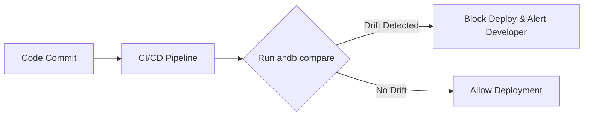

# Case Study: Catching Schema Drift in CI/CD

How a financial tech platform uses TheAndb CLI to detect unauthorized database alterations and enforce DDL compliance automatically.

## The Challenge

In fast-moving development teams, "schema drift" is a major problem:
*   Developers occasionally modify local database structures to test features but forget to check in the corresponding migration script.
*   DBAs might apply emergency indexes directly on Production databases under load without backporting them to Git or the UAT staging environment.
*   Over time, Dev, UAT, Staging, and Production environments diverge, causing future automated migrations to fail or lock tables.

---

## TheAndb Solution

To solve this, the engineering team integrated **TheAndb CLI** directly into their GitHub Actions CI/CD pipeline.



### The CI/CD Pipeline Configuration
A daily automated pipeline runs to check for schema compliance:
1.  **Extract Current State**: The pipeline exports the schema from the staging database to a temporary directory.
2.  **Run Comparison**: The CLI runs a headless comparison against the source-of-truth SQL files stored in Git:
    ```bash
    andb compare --source git-schema/ --dest database-staging -f json > drift-report.json
    ```
3.  **Fail-Fast Check**: If the JSON report indicates any `different`, `missing_in_target`, or `missing_in_source` objects, the step fails:
    ```bash
    # Check if total changes in report is greater than 0
    node -e "if (require('./drift-report.json').summary.totalChanges > 0) process.exit(1)"
    ```

---

## The Result

Since implementing the automated drift check:
*   **100% of schema drift incidents** are caught before code hits Production.
*   No more broken staging pipelines due to missing columns or mismatching collations.
*   Absolute audit trail of all schema modifications, synced with git-commits.

> "TheAndb CLI turned our database schema from a black box into a fully version-controlled, auditable asset." - Lead DevOps Engineer
