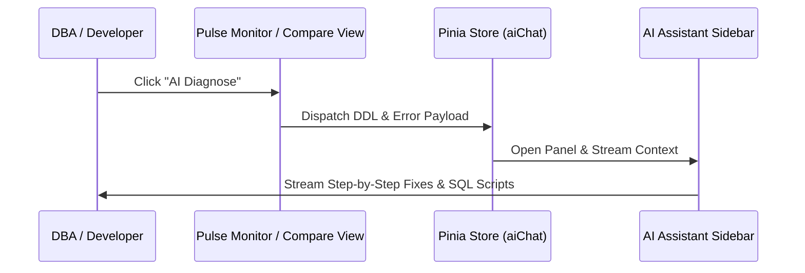

# AI Diagnosis & Pulse Monitor

Learn how to leverage local AI capabilities and real-time monitoring to diagnose database anomalies and schema issues.

## 1. Database Pulse Monitor

The **Database Pulse** panel provides a live dashboard of your target database environments:
*   **Performance Metrics**: Track queries, memory load, active threads, and schema size.
*   **System Check**: Scans database configurations for potential hazards (e.g., incorrect `sql_mode`, unsafe definer hosts, or suboptimal pool sizes).
*   **Visual Health Check**: Real-time status indicators highlight warning zones in orange or red.

---

## 2. Interactive AI Diagnosis

When the Pulse Monitor flags an issue or when you want an expert opinion on your schema diffs, you can use the **AI Diagnose** system:

### Streaming Findings to AI Assistant
1.  Click **AI Diagnose** on the Pulse panel or Compare Diff view.
2.  The system bundles the relevant DDL structure, performance metadata, and error context.
3.  Instead of opening a disruptive pop-up, the AI assistant sidebar panel automatically slides open.
4.  The assistant streams a step-by-step diagnostic report and suggests immediate resolutions.

---

## 3. Real-World Diagnostic Usecases

*   **Syntax & Definership Audits**: Automatically identifies procedures compiled with missing users or root-only privileges.
*   **Index Optimization**: Analyzes query patterns and table schema to suggest missing composite indexes.
*   **Type Safety**: Flags fields with type mismatches (e.g., comparing `INT` with `VARCHAR` keys across foreign key relationships).

---

> [!TIP]
> The AI integration supports markdown output with copyable SQL command snippets. You can copy the suggested fixes and execute them directly in your query console.
