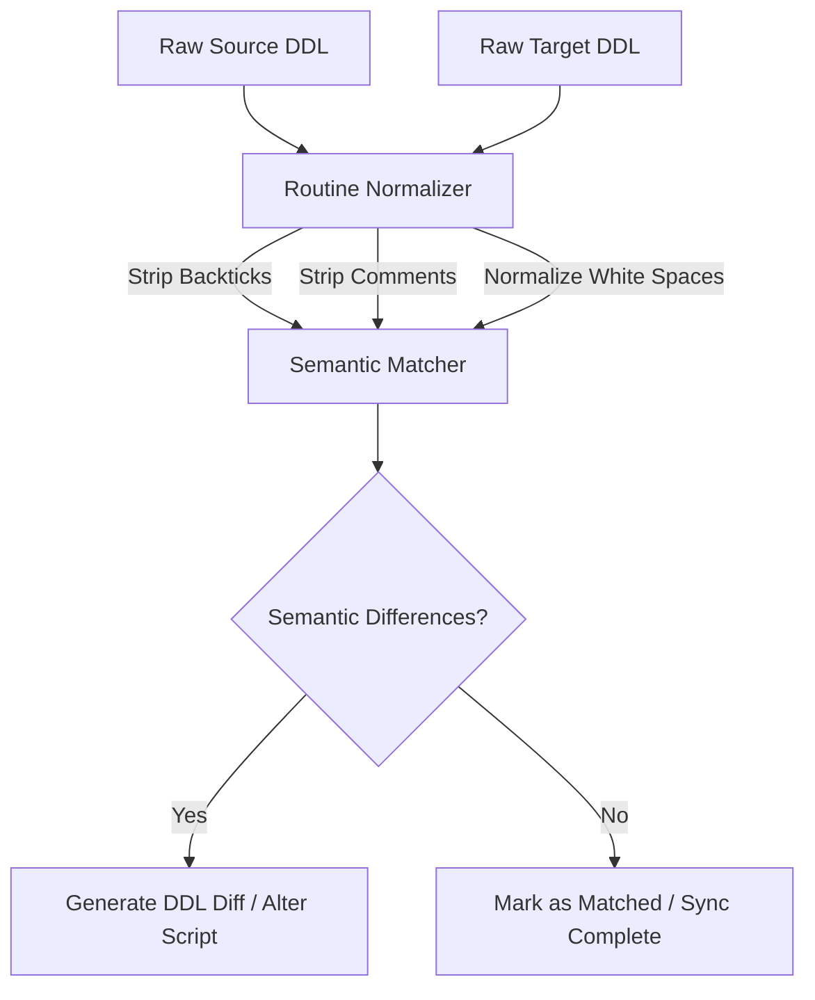

# Hybrid Comparison Engine

Discover how TheAndb's comparison algorithm normalizes database schemas to eliminate noise and isolate true semantic differences.

## The Problem with Plain Text Diffs

Traditional database diff tools compare DDL dumps using plain text diff algorithms. This results in numerous false positives due to:
*   Different indentation (tabs vs. spaces).
*   Presence of MySQL comments or parameter comments.
*   Quoting inconsistencies (backticks vs. unquoted identifiers).
*   Varying lowercase/uppercase styles in SQL keywords.
*   Inconsistent ordering of keys or constraints.

---

## The TheAndb Hybrid Approach

TheAndb implements a **Hybrid Comparison Engine** that parses, normalizes, and compares schema objects semantically.

### 1. Routine Normalization
For stored procedures, functions, triggers, and views, `ParserService` applies aggressive routine normalization (`normalizeRoutineDDL`):
*   **Whitespaces & Tabs**: Double spaces and tabs are normalized to a single space.
*   **Newline Preservation**: Newlines are preserved to keep trailing comments from breaking parameter lists or statement blocks.
*   **Definer Extraction**: MySQL `DEFINER` clauses (e.g. `DEFINER=`root`@`localhost``) are stripped out during comparison to prevent environment-specific developer accounts from flagging false differences.

### 2. Charset & Collation Parity
TheAndb parses the character sets and collations of tables and database definitions:
*   Maintains tracking details in a local SQLite table (`ddl_exports`).
*   Ensures that character set adjustments are included in the generated `ALTER TABLE` statements rather than causing comparisons to fail.

---

> [!TIP]
> Routine normalization means you can safely work with different IDE auto-formatters (e.g. DBeaver, DataGrip, VS Code) without having your schema comparison list cluttered by non-semantic syntax formatting.
